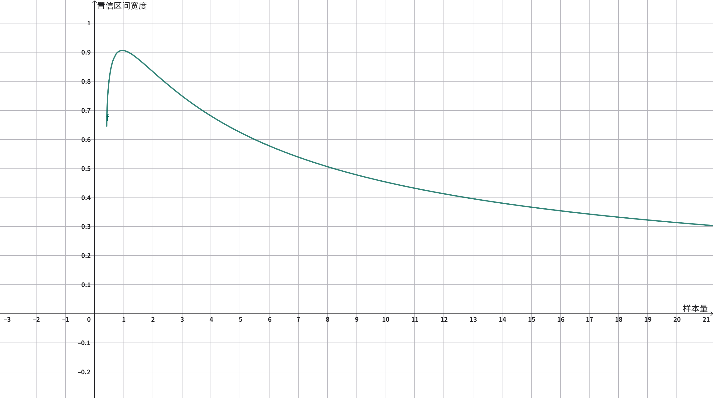

# 单样本率置信区间

## 渐进正态法 {#normal-approx}

样本率 $\hat{p}$ 服从二项分布，$E(\hat{p}) = p$，$Var(\hat{p}) = p(1-p)/n$，渐进正态法计算的置信限可能超出 $[0, 1]$。

=== "双侧置信区间"

    $$
    \begin{align}
    \text{Lower Limit} & = \max\left(p - z_{1-\alpha/2} \sqrt{\frac{p(1-p)}{n}}, 0\right) \\
    \text{Upper Limit} & = \min\left(p + z_{1-\alpha/2} \sqrt{\frac{p(1-p)}{n}}, 1\right)
    \end{align}
    $$

    ??? note "样本量 $n$ 闭式解的分类讨论"

        ??? note "情况 1. $U \ge 1, L \gt 0$"

            $$
            d = 1 - \left(p - z_{1-\alpha/2} \sqrt{\frac{p(1-p)}{n}}\right) \Rightarrow n = \frac{z_{1-\alpha/2}^2 p(1-p)}{\left(d+p-1\right)^2}
            $$

            将上式代入条件：

            $$
            p + z_{1-\alpha/2} \sqrt{\frac{p(1-p)}{n}} \ge 1 \Rightarrow d \ge 2(1-p)
            $$

            $$
            p - z_{1-\alpha/2} \sqrt{\frac{p(1-p)}{n}} \gt 0 \Rightarrow d \lt 1
            $$

            因此，

            $$
            n = \frac{z_{1-\alpha/2}^2 p(1-p)}{\left(d+p-1\right)^2} \ ,\  2(1-p) \le d \lt 1
            $$

        ??? note "情况 2. $U \ge 1, L \le 0$"

            $$
            d = 1 - 0 = 1
            $$

            这种情况下置信区间宽度恒等于 1，与样本量 $n$ 无关，无实际意义。

        ??? note "情况 3. $U \lt 1, L \gt 0$"

            $$
            d = \left(p + z_{1-\alpha/2} \sqrt{\frac{p(1-p)}{n}}\right) - \left(p - z_{1-\alpha/2} \sqrt{\frac{p(1-p)}{n}}\right) \Rightarrow n = \frac{4 z_{1-\alpha/2}^2 p(1-p)}{d^2}
            $$

            将上式代入条件：

            $$
            p + z_{1-\alpha/2} \sqrt{\frac{p(1-p)}{n}} \lt 1 \Rightarrow d \lt 2(1-p)
            $$

            $$
            p - z_{1-\alpha/2} \sqrt{\frac{p(1-p)}{n}} \gt 0 \Rightarrow d \lt 2p
            $$

            因此，

            $$
            n = \frac{4 z_{1-\alpha/2}^2 p(1-p)}{d^2} \ ,\  d \lt \max\left\lbrace 2p, 2(1-p) \right\rbrace
            $$

        ??? note "情况 4. $U \lt 1, L \le 0$"

            $$
            d = \left(p + z_{1-\alpha/2} \sqrt{\frac{p(1-p)}{n}}\right) - 0 \Rightarrow n = \frac{z_{1-\alpha/2}^2 p(1-p)}{(d-p)^2}\ 且 \ d \gt p
            $$

            将上式代入条件：

            $$
            p + z_{1-\alpha/2} \sqrt{\frac{p(1-p)}{n}} \lt 1 \Rightarrow d \lt 1
            $$

            $$
            p - z_{1-\alpha/2} \sqrt{\frac{p(1-p)}{n}} \le 0 \Rightarrow d \ge 2p
            $$

            因此，

            $$
            n = \frac{z_{1-\alpha/2}^2 p(1-p)}{(d-p)^2} \ ,\  2p \le d \lt 1
            $$

        综上，

        $$
        n =
        \begin{cases}
        \frac{z_{1-\alpha/2}^2 p(1-p)}{\left(d+p-1\right)^2} &, 2(1-p) \le d \lt 1 \\
        \frac{4 z_{1-\alpha/2}^2 p(1-p)}{d^2}                &, d \lt \max\left\lbrace 2p, 2(1-p) \right\rbrace \\
        \frac{z_{1-\alpha/2}^2 p(1-p)}{(d-p)^2}              &, 2p \le d \lt 1
        \end{cases}
        $$

=== "左侧置信区间"

    $$
    \begin{align}
    \text{Lower Limit} & = 0 \\
    \text{Upper Limit} & = \min\left(p + z_{1-\alpha/2} \sqrt{\frac{p(1-p)}{n}}, 1\right)
    \end{align}
    $$

=== "右侧置信区间"

    $$
    \begin{align}
    \text{Lower Limit} & = \max\left(p - z_{1-\alpha/2} \sqrt{\frac{p(1-p)}{n}}, 0\right) \\
    \text{Upper Limit} & = 1
    \end{align}
    $$

## 渐进正态法（连续性校正） {#normal-approx-cc}

在 [渐进正态法](#normal-approx) 的基础上添加校正项 $\frac{1}{2n}$，置信限仍可能超出 $[0, 1]$：

=== "双侧置信区间"

    $$
    \begin{align}
    \text{Lower Limit} & = \max\left(p - z_{1-\alpha/2} \sqrt{\frac{p(1-p)}{n}} - \frac{1}{2n}, 0\right) \\
    \text{Upper Limit} & = \min\left(p + z_{1-\alpha/2} \sqrt{\frac{p(1-p)}{n}} + \frac{1}{2n}, 1\right)
    \end{align}
    $$

    ??? note "样本量 $n$ 闭式解的分类讨论"

        ??? note "情况 1. $U \ge 1, L \gt 0$"

            $$
            d = 1 - \left(p - z_{1-\alpha/2} \sqrt{\frac{p(1-p)}{n}} - \frac{1}{2n}\right) \Rightarrow \frac{1}{2n} + z_{1-\alpha/2} \sqrt{\frac{p(1-p)}{n}} - (p + d - 1) = 0
            $$

            令 $x = \frac{1}{\sqrt{n}}$，$A = z_{1 - \alpha/2}\sqrt{p(1-p)}$，则：

            $$
            \frac{1}{2}x^2 + Ax - (p + d - 1) = 0
            $$

            解上述一元二次方程，取正根：

            $$
            x = -A + \sqrt{A^2 + 2(p + d - 1)}
            $$

            代入 $x = \frac{1}{\sqrt{n}}$，得：

            $$
            n = \frac{1}{x^2} = \frac{1}{\left(-A + \sqrt{A^2 + 2(p + d - 1)}\right)^2}
            $$

            将上式代入条件，且根据 $\frac{1}{2}x^2 + Ax = p + d - 1$：

            $$
            p + z_{1-\alpha/2} \sqrt{\frac{p(1-p)}{n}} + \frac{1}{2n} \ge 1 \Rightarrow p + Ax + \frac{1}{2}x^2 \ge 1 \Rightarrow d \ge 2(1-p)
            $$

            $$
            p - z_{1-\alpha/2} \sqrt{\frac{p(1-p)}{n}} - \frac{1}{2n} \gt 0 \Rightarrow p - Ax - \frac{1}{2}x^2 \gt 0 \Rightarrow d \lt 1
            $$

            因此，

            $$
            n = \frac{1}{\left(-A + \sqrt{A^2 + 2(p + d - 1)}\right)^2} \ , \ 2(1-p) \le d \lt 1
            $$

        ??? note "情况 2. $U \ge 1, L \le 0$"

            $$
            d = 1 - 0 = 1
            $$

            这种情况下置信区间宽度恒等于 1，与样本量 $n$ 无关，无实际意义。

        ??? note "情况 3. $U \lt 1, L \gt 0$"

            $$
            d = \left(p + z_{1-\alpha/2} \sqrt{\frac{p(1-p)}{n}} + \frac{1}{2n}\right) - \left(p - z_{1-\alpha/2} \sqrt{\frac{p(1-p)}{n}} - \frac{1}{2n}\right)
            $$

            化简:

            $$
            d = 2z_{1-\alpha/2} \sqrt{\frac{p(1-p)}{n}} + \frac{1}{n}
            $$

            令 $x = \frac{1}{\sqrt{n}}$，$A = z_{1 - \alpha/2}\sqrt{p(1-p)}$，则：

            $$
            x^2 + 2Ax - d = 0
            $$

            解上述一元二次方程，取正根：

            $$
            x = -A + \sqrt{A^2 + d}
            $$

            代入 $x = \frac{1}{\sqrt{n}}$，得：

            $$
            n = \frac{1}{x^2} = \frac{1}{\left(-A + \sqrt{A^2 + d}\right)^2}
            $$

            将上式代入条件，且根据 $x^2 + 2Ax = d$：

            $$
            p + z_{1-\alpha/2} \sqrt{\frac{p(1-p)}{n}} + \frac{1}{2n} \lt 1 \Rightarrow p + Ax + \frac{1}{2}x^2 \lt 1 \Rightarrow d \lt 2(1-p)
            $$

            $$
            p - z_{1-\alpha/2} \sqrt{\frac{p(1-p)}{n}} - \frac{1}{2n} \gt 0 \Rightarrow p - Ax - \frac{1}{2}x^2 \gt 0 \Rightarrow d \lt 2p
            $$

            因此，

            $$
            n = \frac{1}{\left(-A + \sqrt{A^2 + d}\right)^2} \ , \ d \lt \min\left\lbrace 2p, 2(1-p) \right\rbrace
            $$

        ??? note "情况 4. $U \lt 1, L \le 0$"

            $$
            d = \left(p - z_{1-\alpha/2} \sqrt{\frac{p(1-p)}{n}} - \frac{1}{2n}\right) - 0
            $$

            令 $x = \frac{1}{\sqrt{n}}$，$A = z_{1 - \alpha/2}\sqrt{p(1-p)}$，则：

            $$
            \frac{1}{2}x^2 + Ax + p - d = 0
            $$

            解上述一元二次方程，取正根：

            $$
            x = -A + \sqrt{A^2 - 2(p - d)}
            $$

            代入 $x = \frac{1}{\sqrt{n}}$，得：

            $$
            n = \frac{1}{x^2} = \frac{1}{\left(-A + \sqrt{A^2 - 2(p - d)}\right)^2}
            $$

            将上式代入条件，且根据 $\frac{1}{2}x^2 + Ax = d - p$：

            $$
            p + z_{1-\alpha/2} \sqrt{\frac{p(1-p)}{n}} + \frac{1}{2n} \lt 1 \Rightarrow p + Ax + \frac{1}{2}x^2 \lt 1 \Rightarrow d \lt 1
            $$

            $$
            p - z_{1-\alpha/2} \sqrt{\frac{p(1-p)}{n}} - \frac{1}{2n} \le 0 \Rightarrow p - Ax - \frac{1}{2}x^2 \le 0 \Rightarrow d \ge 2p
            $$

            因此，

            $$
            n = \frac{1}{\left(-A + \sqrt{A^2 - 2(p - d)}\right)^2} \ , \ 2p \le d \lt 1
            $$

        综上，

        $$
        n =
        \begin{cases}
        \frac{1}{\left(-A + \sqrt{A^2 + 2(p + d - 1)}\right)^2} &, 2(1-p) \le d \lt 1 \\
        \frac{1}{\left(-A + \sqrt{A^2 + d}\right)^2}            &, d \lt \min\left\lbrace 2p, 2(1-p) \right\rbrace \\
        \frac{1}{\left(-A + \sqrt{A^2 - 2(p - d)}\right)^2}     &, 2p \le d \lt 1
        \end{cases}
        $$

        其中，$A = z_{1 - \alpha/2}\sqrt{p(1-p)}$ 。

=== "左侧置信区间"

    $$
    \begin{align}
    \text{Lower Limit} & = 0 \\
    \text{Upper Limit} & = \min\left(p + z_{1-\alpha} \sqrt{\frac{p(1-p)}{n}} + \frac{1}{2n}, 1\right)
    \end{align}
    $$

=== "右侧置信区间"

    $$
    \begin{align}
    \text{Lower Limit} & = \max\left(p - z_{1-\alpha} \sqrt{\frac{p(1-p)}{n}} - \frac{1}{2n}, 0\right) \\
    \text{Upper Limit} & = 1
    \end{align}
    $$

## Clopper-Pearson {#clpooer-pearson}

=== "双侧置信区间"

    $$
    \begin{align}
    \text{Lower Limit} & = \left[ 1 + \frac{n - np + 1}{np F_{\frac{\alpha}{2};\ 2np,\ 2(n - np + 1)}} \right]^{-1} \\
    \text{Upper Limit} & = \left[ 1 + \frac{n - np}{(np + 1) F_{1-\frac{\alpha}{2};\ 2(np + 1), \ 2(n - np)}} \right]^{-1}
    \end{align}
    $$

=== "左侧置信区间"

    $$
    \begin{align}
    \text{Lower Limit} & = 0 \\
    \text{Upper Limit} & = \left[ 1 + \frac{n - np}{(np + 1) F_{1-\alpha;\ 2(np + 1), \ 2(n - np)}} \right]^{-1}
    \end{align}
    $$

=== "右侧置信区间"

    $$
    \begin{align}
    \text{Lower Limit} & = \left[ 1 + \frac{n - np + 1}{np F_{\alpha;\ 2np,\ 2(n - np + 1)}} \right]^{-1} \\
    \text{Upper Limit} & = 1
    \end{align}
    $$

## Wilson Score {#wilson-score}

=== "双侧置信区间"

    $$
    \begin{align}
    \text{Lower Limit} & = \frac{\left(2np + z_{1-\alpha/2}^2\right) - z_{1-\alpha/2} \sqrt{z_{1-\alpha/2}^2 + 4np(1-p)}}{2\left(n + z_{1-\alpha/2}^2\right)} \\
    \text{Upper Limit} & = \frac{\left(2np + z_{1-\alpha/2}^2\right) + z_{1-\alpha/2} \sqrt{z_{1-\alpha/2}^2 + 4np(1-p)}}{2\left(n + z_{1-\alpha/2}^2\right)}
    \end{align}
    $$

=== "左侧置信区间"

    $$
    \begin{align}
    \text{Lower Limit} & = 0 \\
    \text{Upper Limit} & = \frac{\left(2np + z_{1-\alpha}^2\right) + z_{1-\alpha} \sqrt{z_{1-\alpha}^2 + 4np(1-p)}}{2\left(n + z_{1-\alpha}^2\right)}
    \end{align}
    $$

=== "右侧置信区间"

    $$
    \begin{align}
    \text{Lower Limit} & = \frac{\left(2np + z_{1-\alpha}^2\right) - z_{1-\alpha} \sqrt{z_{1-\alpha}^2 + 4np(1-p)}}{2\left(n + z_{1-\alpha}^2\right)} \\
    \text{Upper Limit} & = 1
    \end{align}
    $$

## Wilson Score 连续性校正 {#wilson-score-cc}

=== "双侧置信区间"

    $$
    \begin{align}
    \text{Lower Limit} & = \frac{\left(2np + z_{1-\alpha/2}^2 - 1\right) - z_{1-\alpha/2} \sqrt{z_{1-\alpha/2}^2 - \frac{1}{n} + 4np(1-p) + 4p - 2}}{2\left(n + z_{1-\alpha/2}^2\right)} \\
    \text{Upper Limit} & = \frac{\left(2np + z_{1-\alpha/2}^2 + 1\right) + z_{1-\alpha/2} \sqrt{z_{1-\alpha/2}^2 - \frac{1}{n} + 4np(1-p) - 4p + 2}}{2\left(n + z_{1-\alpha/2}^2\right)}
    \end{align}
    $$

=== "左侧置信区间"

    $$
    \begin{align}
    \text{Lower Limit} & = 0 \\
    \text{Upper Limit} & = \frac{\left(2np + z_{1-\alpha}^2 + 1\right) + z_{1-\alpha} \sqrt{z_{1-\alpha}^2 - \frac{1}{n} + 4np(1-p) - 4p + 2}}{2\left(n + z_{1-\alpha}^2\right)}
    \end{align}
    $$

=== "右侧置信区间"

    $$
    \begin{align}
    \text{Lower Limit} & = \frac{\left(2np + z_{1-\alpha}^2 - 1\right) - z_{1-\alpha} \sqrt{z_{1-\alpha}^2 - \frac{1}{n} + 4np(1-p) + 4p - 2}}{2\left(n + z_{1-\alpha}^2\right)} \\
    \text{Upper Limit} & = 1
    \end{align}
    $$

??? note "Wilson Score 连续性校正置信区间宽度随样本量 $n$ 的变化"

    以 $p = 0.9$ 为例，绘制双侧 95% 置信区间宽度随样本量 $n$ 变化的图像如下：
    

    如果将 $n$ 视为连续性变量，则随着 $n$ 的增大，置信区间宽度先增大后减小，这可能会给数值求解带来一些麻烦。

    若设定置信区间宽度为 $0.8$，则理论上存在两个数值解，实际应取较大的解作为样本量估算结果。

    [brentq][scipy.optimize.brentq] 要求求根区间左右两端点处的函数值异号，此时可先用 [minimize_scalar][scipy.optimize.minimize_scalar] 求出区间内的极大值，将极大值点作为求根区间下限，再应用 [brentq][scipy.optimize.brentq] 进行数值求解。
